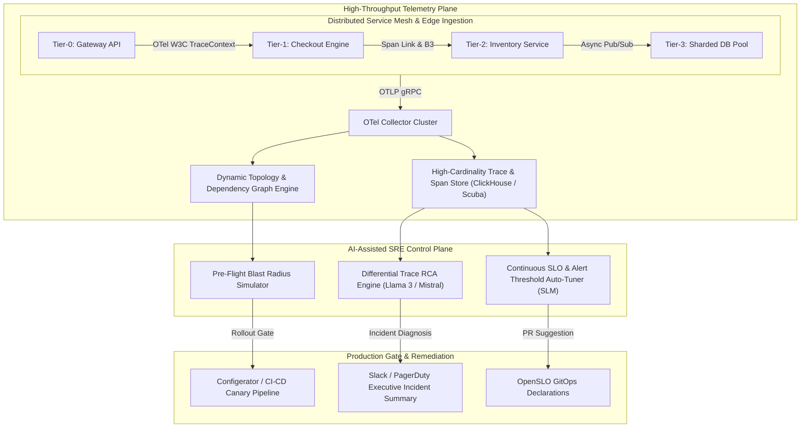
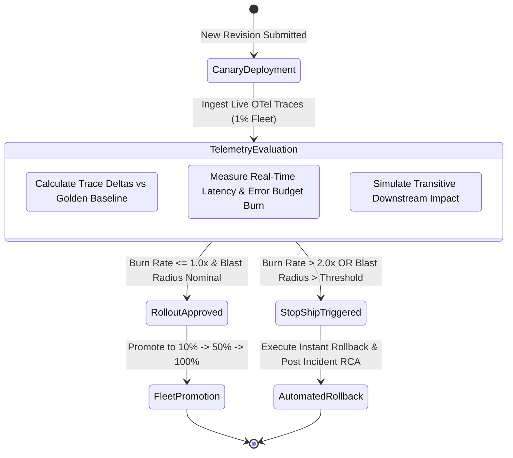

# Advanced Observability SRE: Service-Centric SLO Dependency & Blast Radius Engine 🔭

> **Enterprise reference architecture for real-time microservice blast-radius estimation, OpenTelemetry span-link dependency graph generation, and LLM-assisted root cause analysis at hyperscale.**

[](https://opentelemetry.io/)
[](#technical-architecture)
[](#2-differential-trace-root-cause-analysis-rca)
[](#sre-fundamental-closed-loop-error-budget-enforcement)
[](#faang-production-engineering-tool-mapping)
[](LICENSE)

---

## 🧭 Executive Summary & Production Engineering Thesis

In large-scale distributed architectures spanning tens of thousands of microservices, service degradation is inherently non-linear. A fractional latency regression or intermittent timeout in an unheralded Tier-3 storage shard can cascade through connection pools, backpressure buffers, and dependency chains to trigger catastrophic brownouts in customer-facing Tier-0 APIs.

Traditional observability paradigms fall short at modern scale:
- **Static Topology Maps:** Static architecture diagrams rot instantly in continuous-deployment environments where thousands of daily canary pushes mutate call paths.
- **Alert Fatigue & Cognitive Overload:** When a high-impact incident occurs, hundreds of cascading downstream alerts fire simultaneously, obscuring the true origin point.
- **Disconnected Deployment Safety:** Rollout pipelines evaluate localized unit tests but lack visibility into the live, multi-hop systemic blast radius of a configuration push.

**Advanced Observability SRE** provides an autonomous, service-centric reliability control plane. Built upon vendor-neutral **OpenTelemetry (OTel)** tracing primitives, it dynamically reconstructs real-time service dependency graphs, runs continuous **LLM-assisted Differential Trace Root Cause Analysis (RCA)**, and enforces pre-flight **Blast Radius Simulations** directly within the continuous deployment pipeline to halt unsafe rollouts before error budgets are depleted.

---

## 📐 Mathematical Formulation of Blast Radius

To quantify the systemic risk of an impending deployment or degraded component, the framework models the system as a directed acyclic dependency multigraph $G = (V, E, W)$:

$$\text{Blast Radius Index } (BRI) \text{ for service } S_k:$$

$$BRI(S_k) = \sum_{S_j \in \mathcal{D}(S_k)} w_{kj} \cdot \mathcal{C}(S_j) \cdot \left(\frac{\text{RPS}(S_j)}{\sum_{m \in V} \text{RPS}(S_m)}\right) \cdot \Delta \text{SLO}_{j}$$

Where:
- $\mathcal{D}(S_k)$ is the transitive closure of all downstream dependencies impacted by $S_k$.
- $w_{kj} \in [0, 1]$ represents the coupling elasticity (soft dependency vs. hard blocking RPC).
- $\mathcal{C}(S_j) \in \{1, 10, 100, 1000\}$ denotes the Tier criticality class (Tier-3 through Tier-0).
- $\text{RPS}(S_j)$ is the normalized request-per-second throughput volume.
- $\Delta \text{SLO}_j$ is the projected degradation delta against the service's published latency or availability SLO.

If $BRI(S_k) \times \tau_{\text{rollout}} > \text{Remaining Error Budget}(S_{\text{Tier-0}})$, the deployment pipeline automatically asserts a **Fail-Closed Stop-Ship signal**.

---

## 🏛️ Technical Architecture



---

## 🔬 Core Capabilities

### 1. Dynamic OTel-Driven Dependency Mapping
- Implements **W3C TraceContext** and **B3 Context Propagation** across all synchronous RPCs and asynchronous messaging boundaries.
- Reconstructs real-time service dependency graphs by extracting parent-child span relationships and `SpanLinks` directly from live production telemetry.
- Detects hidden circular dependencies and unintended transitive calls introduced by canary releases.

### 2. Differential Trace Root Cause Analysis (RCA)
- When an SLO threshold is breached, the engine isolates a window of **Golden Traces** (nominal p50–p95 execution) and compares them against degraded traces.
- Generates structured, deterministic trace deltas highlighting latency outliers, error code distributions, and payload serialization bottlenecks.
- Prompts an LLM (e.g., Llama 3) to synthesize a concise, human-in-the-loop executive diagnosis:
  > *"Incident INC-842: Service `checkout-api` is breaching its p99 250ms latency SLO. Root cause: Downstream `inventory-db` shard #4 is experiencing lock contention following config change `#9812` (batch size increase from 100 to 5,000). Recommended mitigation: Roll back config revision `#9812`."*

### 3. Pre-Flight Blast Radius Simulation
- Integrated directly into canary rollout gates. Before code or configuration propagates beyond 1% of the fleet, the engine simulates component degradation across the dependency multigraph.
- Computes whether potential failure modes will exhaust Tier-0 error budgets within the canary evaluation window.

### 4. Continuous SLM-Driven SLO Auto-Tuning
- Employs lightweight, localized Small Language Models (SLMs) to analyze 30-day historical rolling latency and error distributions.
- Identifies "tight" SLOs driving alert fatigue and "loose" SLOs masking user degradation, submitting automated pull requests to update OpenSLO manifests.

---

## 🏢 FAANG Production Engineering Tool Mapping

This architecture directly maps internal hyperscale tooling patterns (such as Meta's internal PE stack and Google's SRE ecosystem) to modern open standards:

| Hyperscale Internal Tool (e.g. Meta) | Open-Source / Cloud-Native Equivalent | Role in Advanced Observability Platform |
| :--- | :--- | :--- |
| **Canopy** | OpenTelemetry Tracing + Jaeger / Tempo | End-to-end distributed tracing across microservice boundaries. |
| **Scuba** | ClickHouse / Apache Pinot | Sub-second high-cardinality aggregation of multi-dimensional trace data. |
| **Configerator** | ArgoCD / Flux + OpenSLO Gateways | Safe, version-controlled configuration rollout with automated health stops. |
| **FBAR (Auto-Remediation)** | Kubernetes Operators / Custom Controllers | Automated mitigation dispatch (drain, scale, restart, canary revert). |
| **Service Mesh (SM)** | Envoy / Istio / Cilium eBPF | Uniform L7 traffic routing, circuit breaking, and telemetry injection. |

---

## 🛡️ SRE Fundamental: Closed-Loop Error Budget Enforcement



### OpenSLO Policy Specification Example

```yaml
apiVersion: openslo/v1alpha
kind: SLO
metadata:
  name: checkout-latency-tier0
  displayName: Checkout Service Tier-0 Latency SLO
spec:
  service: checkout-service
  description: 99.0% of requests must complete in under 250ms over a rolling 30-day window
  budgetingMethod: Occurrences
  objectives:
    - target: 0.99
      timeSliceWindow: 5m
      indicator:
        metadata:
          name: otel_grpc_server_duration_ms
        spec:
          ratioMetrics:
            total:
              metricSource:
                spec:
                  query: sum(rate(rpc_server_duration_count{service="checkout"}[5m]))
            good:
              metricSource:
                spec:
                  query: sum(rate(rpc_server_duration_bucket{service="checkout", le="250"}[5m]))
  alertPolicies:
    - name: blast-radius-canary-block
      conditions:
        - kind: BurnRate
          op: gt
          value: 2.5
          period: 15m
```

---

## 📂 Repository Topology

```text
advanced-observability-sre/
├── README.md               # Executive Architecture & Production Engineering Specification
├── PROPOSAL.md             # Original RFC & Technical Motivation
└── docs/                   # Deep-dive whitepapers & SLO design guides
```

---

## 📄 License & Contact

Distributed under the **MIT License**. Maintained by **Hooman Parta** ([@hoomanp](https://github.com/hoomanp)).
